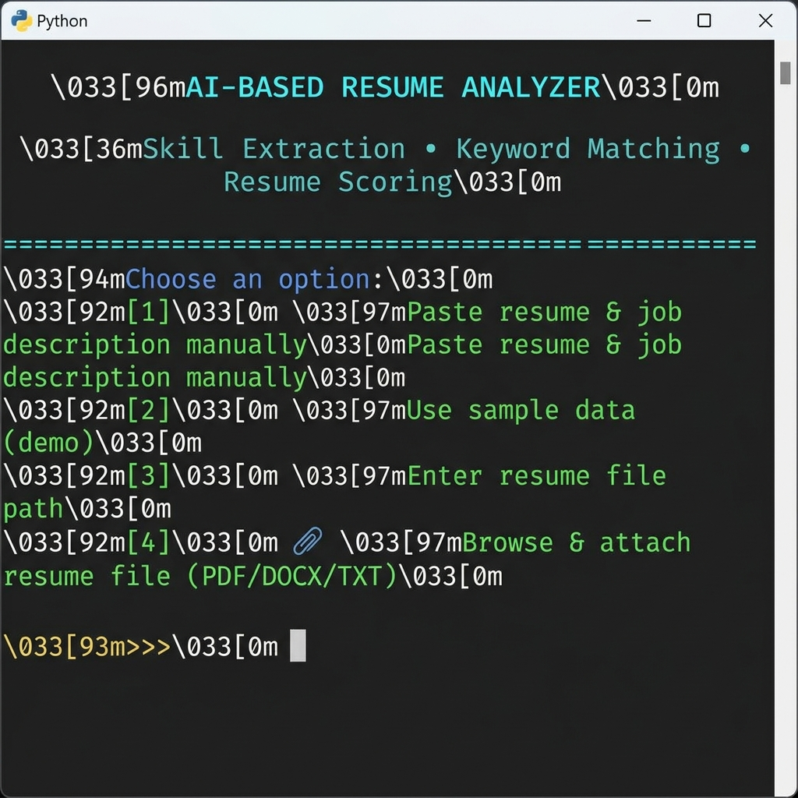
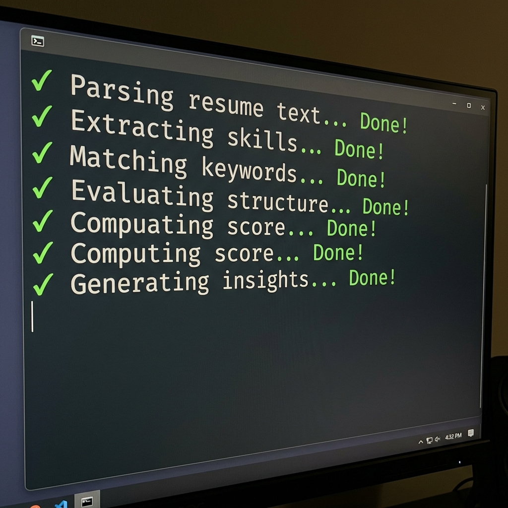
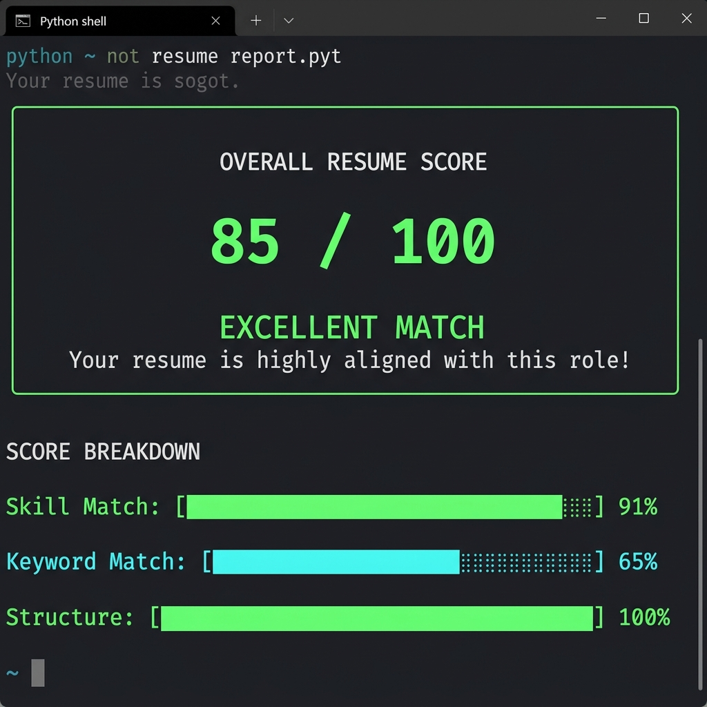
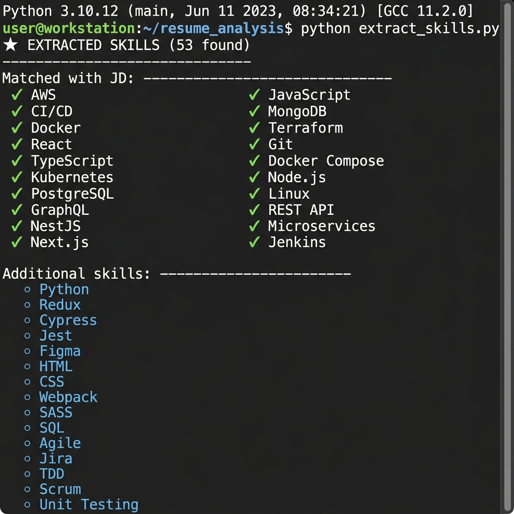
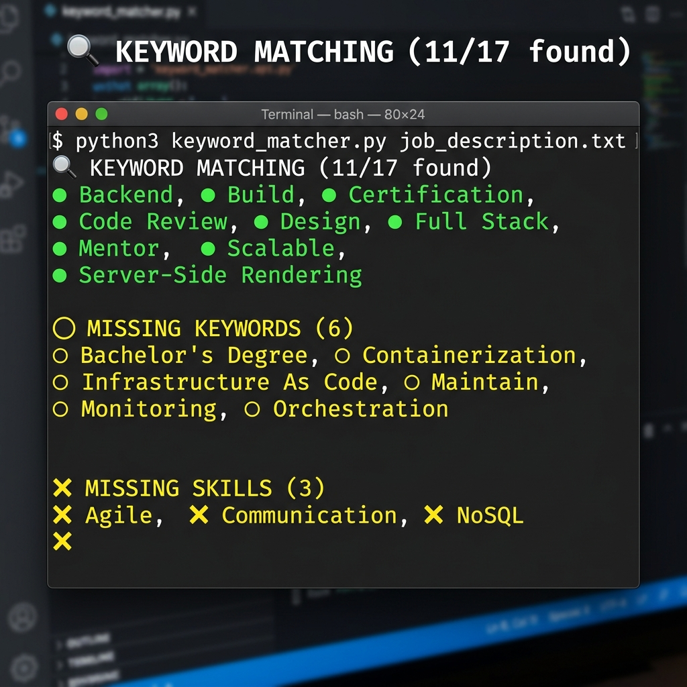
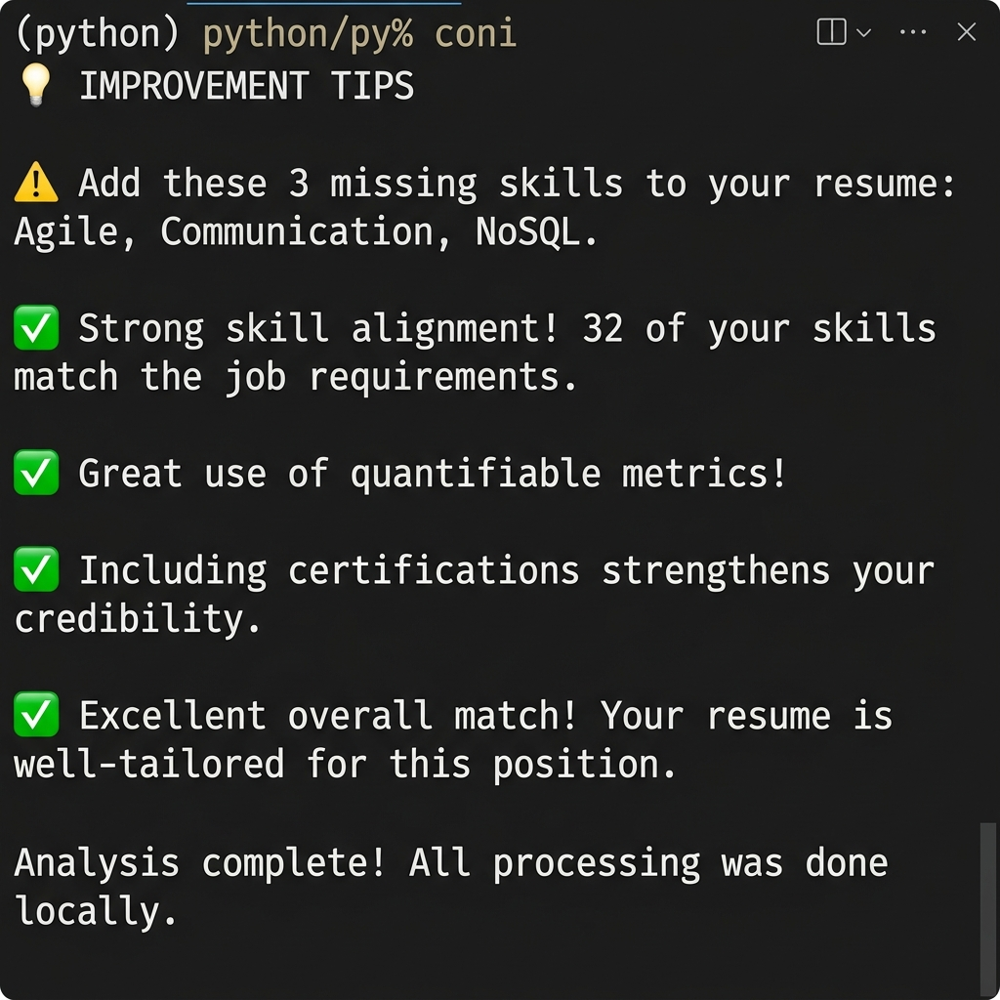

# 🔍 AI-Based Resume Analyzer

An intelligent Python-based resume analysis tool that extracts skills, matches keywords against job descriptions, and provides a comprehensive resume score with actionable improvement suggestions.


---

## 📋 Table of Contents

- [Features](#features)
- [Screenshots](#screenshots)
- [Installation](#installation)
- [Usage](#usage)
- [How It Works](#how-it-works)
- [Project Structure](#project-structure)
- [Technologies Used](#technologies-used)
- [Future Enhancements](#future-enhancements)

---

## ✨ Features

### 1. 🧠 Skill Extraction
- Scans resume text using a **400+ skill database** across **8 categories**:
  - Programming Languages, Frameworks & Libraries, Cloud & DevOps
  - Databases, Data & AI/ML, Tools & Practices
  - Soft Skills, Security & Architecture
- Intelligent regex-based parsing with proper capitalization normalization

### 2. 🔍 Keyword Matching
- Extracts important keywords, phrases, and requirements from job descriptions
- Identifies action verbs, experience requirements, and education qualifications
- Shows **found vs missing** keywords with visual indicators

### 3. 📊 Resume Scoring
- **Overall Score (0-100)** combining three sub-scores:
  - **Skill Match (45%)** — How many JD skills appear in your resume
  - **Keyword Match (30%)** — How many JD keywords are present
  - **Structure & Content (25%)** — Resume formatting, sections, metrics, action verbs
- Color-coded verdicts: Excellent / Good / Fair / Poor

### 4. 📎 File Upload Support
- **Native file picker dialog** (browse & select files)
- Supports **PDF**, **DOCX**, and **TXT** formats
- Auto-installs required libraries (PyPDF2, python-docx) when needed

### 5. ⚠️ Error Handling
- Validates input length and file formats
- Handles encoding issues, empty files, and scanned PDFs
- Graceful fallbacks for missing dependencies

### 6. 💡 Improvement Suggestions
- Actionable tips based on analysis results
- Identifies missing skills, structural weaknesses, and content gaps

---

## 📸 Screenshots

| Feature | Screenshot |
|---------|-----------|
| Main Menu |  |
| Analysis Loading |  |
| Score Display |  |
| Skills Extracted |  |
| Keyword Matching |  |
| Improvement Tips |  |

---

## 🛠️ Installation

### Prerequisites
- Python 3.8 or higher

### Steps

```bash
# 1. Clone the repository
git clone https://github.com/yourusername/ai-resume-analyzer.git
cd ai-resume-analyzer

# 2. (Optional) Create a virtual environment
python -m venv venv
venv\Scripts\activate        # Windows
source venv/bin/activate     # macOS/Linux

# 3. Install optional dependencies (for PDF/DOCX support)
pip install PyPDF2 python-docx
```

> **Note:** The core analyzer uses only Python standard library modules. PDF and DOCX support libraries are installed automatically when needed.

---

## 🚀 Usage

### Interactive Mode
```bash
python resume_analyzer.py
```
Choose from:
1. **Paste** resume & job description manually
2. **Use sample data** (built-in demo)
3. **Enter file path** to a resume file
4. **📎 Browse & attach** resume file (opens native file picker)

### Quick Demo (Sample Data)
```bash
python resume_analyzer.py --sample
```

### Load Resume from File
```bash
python resume_analyzer.py --resume path/to/resume.pdf
```

### Supported File Formats
| Format | Extension | Library Required |
|--------|-----------|-----------------|
| Plain Text | `.txt`, `.md` | None (built-in) |
| PDF | `.pdf` | PyPDF2 (auto-install) |
| Word Document | `.docx`, `.doc` | python-docx (auto-install) |

---

## ⚙️ How It Works

```
┌─────────────────┐     ┌─────────────────┐
│  Resume Text    │     │ Job Description │
│  (.pdf/.docx/   │     │  (pasted text)  │
│   .txt/paste)   │     │                 │
└────────┬────────┘     └────────┬────────┘
         │                       │
         ▼                       ▼
┌─────────────────────────────────────────┐
│         ANALYSIS ENGINE                 │
│                                         │
│  1. Skill Extraction (regex + 400+ DB)  │
│  2. Keyword Extraction (NLP patterns)   │
│  3. Skill Matching (resume vs JD)       │
│  4. Keyword Matching                    │
│  5. Structure Analysis                  │
│  6. Score Computation                   │
│  7. Suggestion Generation               │
└────────────────┬────────────────────────┘
                 │
                 ▼
┌─────────────────────────────────────────┐
│         RESULTS DASHBOARD               │
│                                         │
│  • Overall Score (0-100)                │
│  • Sub-scores (Skill/Keyword/Structure) │
│  • Extracted Skills (matched + extra)   │
│  • Missing Keywords                     │
│  • Improvement Suggestions              │
└─────────────────────────────────────────┘
```

### Scoring Formula
```
Overall Score = (Skill Match × 0.45) + (Keyword Match × 0.30) + (Structure × 0.25)
```

---

## 📁 Project Structure

```
Antigravity/
├── Source_Code/
│   └── resume_analyzer.py      # Main Python application
├── Screenshots/
│   ├── 01_main_menu.png
│   ├── 02_loading.png
│   ├── 03_score_display.png
│   ├── 04_skills_extracted.png
│   ├── 05_keyword_matching.png
│   └── 06_improvement_tips.png
├── Prompt_Log/
│   └── prompt_log.md           # AI prompts used during development
├── Report.md                   # Detailed project report
├── README.md                   # This file
└── GitHub_Link.txt             # GitHub repository URL
```

---

## 🧰 Technologies Used

| Technology | Purpose |
|-----------|---------|
| **Python 3.8+** | Core programming language |
| **re (regex)** | Skill extraction & pattern matching |
| **tkinter** | Native file picker dialog |
| **PyPDF2** | PDF text extraction (optional) |
| **python-docx** | DOCX text extraction (optional) |
| **ANSI Escape Codes** | Colored terminal output |
| **os / sys** | File handling & system operations |

---

## 🔮 Future Enhancements

- [ ] Add support for more file formats (RTF, ODT)
- [ ] Integrate with OpenAI/Gemini API for AI-powered suggestions
- [ ] Web-based GUI version using Flask/Streamlit
- [ ] ATS (Applicant Tracking System) compatibility checker
- [ ] Resume template generator based on analysis
- [ ] Multi-language resume support
- [ ] Export analysis report as PDF

---

## 👤 Author

**Abhinav Singh**

---

## 📄 License

This project is licensed under the MIT License — see the [LICENSE](LICENSE) file for details.

---

> ⚡ *All analysis runs locally. Your resume data never leaves your machine.*
